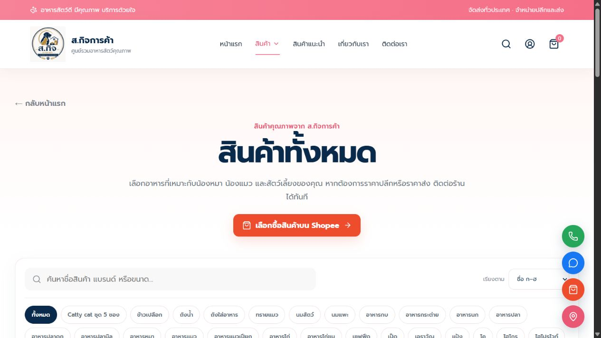
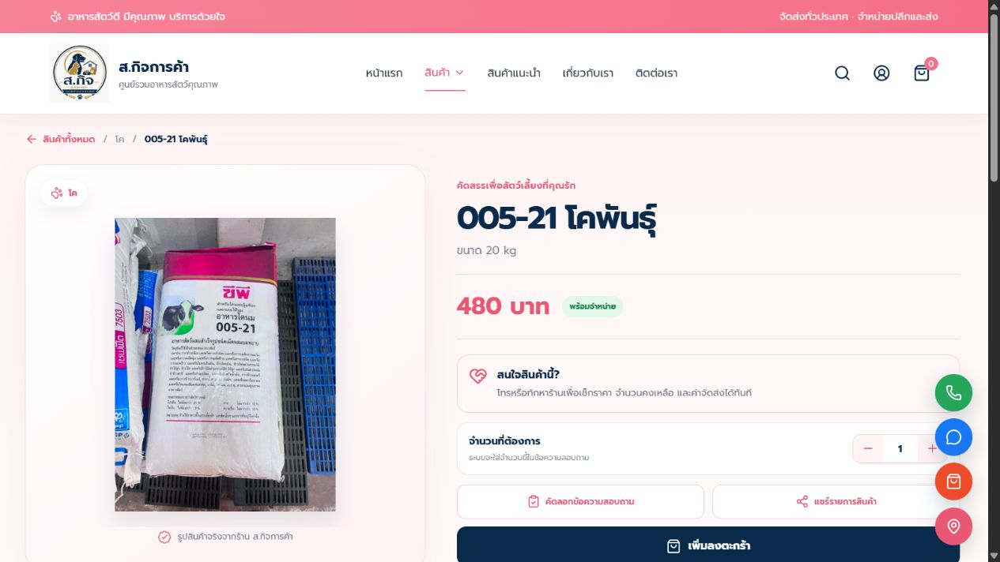
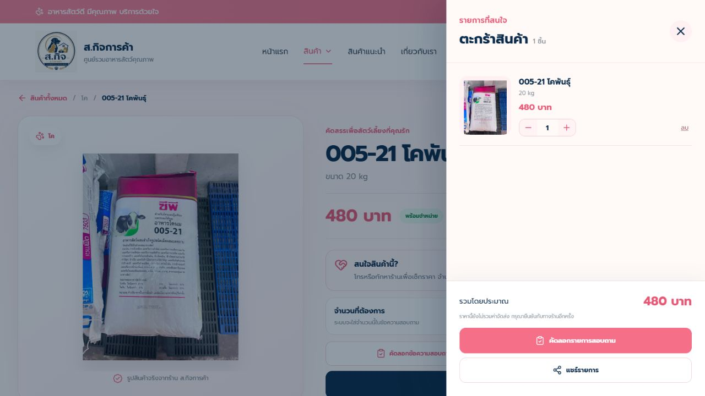

# คู่มือการใช้งาน ส.กิจการค้า

หน้าเว็บร้านและระบบหลังบ้าน Laravel • ฉบับ 1.0 • 7 กันยายน 2569

จัดทำจากโค้ดปัจจุบันของโครงการ ไม่ใช่การยืนยันว่าระบบออนไลน์ deploy รุ่นเดียวกันแล้วทุกส่วน ชื่อเมนูอาจต่างกันหากใช้งานรุ่นเก่า คู่มือนี้ไม่รวมข้อมูลลูกค้าจริงหรือรหัสผ่าน

## 1. เริ่มต้น

| ส่วนใช้งาน | ที่อยู่ |
|---|---|
| หน้าร้าน | https://alert-patience-production-1942.up.railway.app/shop |
| เข้าหลังบ้าน | https://alert-patience-production-1942.up.railway.app/login |
| รายละเอียดสินค้า | กดสินค้าจากหน้าร้าน เพื่อเปิด `/shop/product/{id}` |

หากร้านเปลี่ยนโดเมน ให้ใช้โดเมนใหม่ตามด้วยเส้นทางเดิม ลูกค้าดูสินค้าและใช้ตะกร้าได้โดยไม่สมัครสมาชิก พนักงานต้องมีบัญชีจากผู้ดูแล

## 2. สำหรับลูกค้า: ค้นหาและเลือกสินค้า


ภาพ 1 — หน้าแรก ใช้เมนูสินค้าและไอคอนค้นหาด้านบนเพื่อเริ่มเลือกซื้อ



ภาพ 2 — หน้ารวมสินค้า เลือกหมวดหมู่ ค้นหา และเรียงลำดับรายการ

1. เปิดหน้าร้าน กด **สินค้า** บน Navbar
2. เลือก **สินค้าทั้งหมด** หรือหมวดหมู่ใน Dropdown
3. พิมพ์ชื่อ ประเภท หรือขนาดในช่องค้นหา หรือใช้ไอคอนค้นหาบน Navbar แล้วกด **ค้นหา**
4. เลือกเรียงตามชื่อ ราคา หรือมีสินค้าก่อน
5. เปลี่ยนหน้ารายการเมื่อมีหลายหน้า แล้วกด **ดูรายละเอียด**

บนมือถือเปิดเมนูจากปุ่มเมนู หมวดหมู่ในหน้ารวมเลื่อนแนวนอนได้ Dropdown ปิดด้วยการกดเมนูอีกครั้ง คลิกด้านนอก หรือกด Escape บนคอมพิวเตอร์

ตรวจชื่อ ขนาด ราคา และสถานะก่อนเลือกจำนวน ราคาแสดงเป็น **900 บาท** เป็นต้น หากไม่มีราคามากกว่าศูนย์จะแสดง **สอบถามราคา** สินค้าหมดไม่เปิดให้เพิ่มตะกร้า

## 3. สำหรับลูกค้า: ตะกร้าและสอบถามร้าน



ภาพ 3 — ตรวจชื่อ ขนาด ราคา และเลือกจำนวนในหน้ารายละเอียด



ภาพ 4 — ตะกร้าตัวอย่างสำหรับอธิบายขั้นตอน ไม่ใช่คำสั่งซื้อที่ส่งถึงร้าน

1. กด **ใส่ตะกร้า** จากหน้ารวม หรือเลือกจำนวนในหน้ารายละเอียดแล้วกด **เพิ่มลงตะกร้า**
2. เปิดตะกร้าจากไอคอนถุงบน Navbar ตัวเลขคือจำนวนชิ้นรวม
3. กดบวก/ลบเพื่อแก้จำนวน กด **ลบ** หากไม่ต้องการรายการนั้น
4. ตรวจรายการและยอดรวมโดยประมาณ
5. กด **คัดลอกรายการสอบถาม** แล้วนำไปวางและส่งในแชตร้าน หรือกด **แชร์รายการ** แล้วเลือกแอป
6. รอร้านยืนยันสินค้า ราคา และค่าจัดส่งก่อนตกลงซื้อ

**สำคัญ:** ใส่ตะกร้าไม่ได้จองสินค้า ไม่ตัดสต็อก ไม่ชำระเงิน และยังไม่สร้างออเดอร์เข้า Laravel การคัดลอกยังไม่ส่งข้อความถึงร้าน ต้องวางและส่งเอง

ตะกร้าเก็บในเบราว์เซอร์ของเครื่องนั้น รีเฟรชทั่วไปยังอยู่ แต่เปลี่ยนเครื่อง ล้างข้อมูลเว็บไซต์ หรือใช้โหมดส่วนตัวอาจไม่มีรายการเดิม ราคาในตะกร้าอาจเก่า ยอดรวมตัวเลขไม่รวมรายการที่ต้องสอบถามราคาและค่าจัดส่ง ให้ร้านยืนยันอีกครั้ง

หน้ารายละเอียดมีปุ่มคัดลอก/แชร์สินค้ารายชิ้นด้วย ปุ่ม Shopee เปิดหน้าร้าน ไม่ใช่สินค้านั้นโดยตรง Facebook ปัจจุบันเป็นลิงก์ค้นหาชื่อร้าน ให้ตรวจร้านก่อนส่งข้อความ

### ช่องทางร้าน

- โทร 095-669-9178
- อีเมล swisuttiya1@gmail.com
- Facebook: ส.กิจการค้า
- 369 หมู่ 1 ต.ศรีสุทโธ อ.บ้านดุง จ.อุดรธานี 41190
- แผนที่ https://maps.app.goo.gl/YLaEaMjqeYFKG2uP8

มือถือกด **ติดต่อร้าน** เพื่อเปิดช่องทางต่าง ๆ เวลาทำการและอัตราค่าส่งยังไม่มีข้อมูลยืนยันในคู่มือนี้ ให้สอบถามร้านโดยตรง

## 4. สำหรับพนักงาน: เข้าสู่ระบบ


ภาพ 5 — หน้าลงชื่อเข้าใช้ ใช้อีเมลและรหัสผ่านของพนักงาน ภาพถ่ายโดยไม่มีการกรอกบัญชี

ภาพหน้าจอในฉบับนี้ถ่ายจากเว็บไซต์ออนไลน์วันที่ 7 กันยายน 2569 ภาพเมนูภายในหลังบ้านยังรอเข้าสู่ระบบเพื่อเก็บภาพเพิ่มเติม

1. เปิด `/login`
2. กรอกอีเมลและรหัสผ่านที่ผู้ดูแลให้
3. เข้าสู่ระบบ จะเปิดหน้าที่บัญชีมีสิทธิ์
4. หากใช้เครื่องร่วมกัน อย่าจำการเข้าสู่ระบบ และออกจากระบบเมื่อเสร็จงาน

รหัสผิดหลายครั้งอาจถูกพักชั่วคราว ให้รอตามเวลาที่หน้าจอระบุ หากบัญชีถูกระงับให้ติดต่อเจ้าของร้าน ไม่ต้องส่งรหัสผ่านให้ผู้อื่นตรวจ

### เมนูหลังบ้าน

| เมนู | งานหลัก | สิทธิ์ |
|---|---|---|
| แดชบอร์ด | ภาพรวมและงานที่ต้องติดตาม | ดูรายงาน |
| รับเข้า–เบิกออก | เอกสารเพิ่ม/ลดสต็อก | รับเข้า-เบิกออก |
| สินค้า / ราคา | ข้อมูลสินค้าและยอดคงเหลือ | ดูเมื่อเข้าสู่ระบบ; แก้ไขต้องมีสิทธิ์แก้ไขสินค้า |
| ใกล้หมด / สั่งซื้อ | จุดสั่งซื้อและจำนวนแนะนำ | ดูเมื่อเข้าสู่ระบบ; การเปลี่ยนข้อมูลขึ้นกับสิทธิ์ |
| นับสต็อก | จำนวนจริงและประวัติรอบนับ | นับสต็อก |
| ขายออนไลน์ | ออเดอร์และค่าใช้จ่าย | ขายออนไลน์ |
| ประเภทสินค้า | จัดประเภท | ดูเมื่อเข้าสู่ระบบ; แก้ไขต้องมีสิทธิ์แก้ไขสินค้า |
| รายงาน / กำไร | ยอดขายและกำไรตามช่วงเวลา | ดูรายงาน |
| ผู้ใช้ / สิทธิ์ | บัญชีพนักงาน | จัดการผู้ใช้ |

ตำแหน่งมีเจ้าของ ผู้จัดการร้าน พนักงานคลัง และพนักงานขาย สิทธิ์ปรับรายบุคคลได้ ต้องตรวจสิทธิ์จริง ไม่ใช้ชื่อตำแหน่งอย่างเดียวตัดสิน

## 5. ประเภทสินค้าและสินค้า / ราคา

### เพิ่มประเภท

เข้า **ประเภทสินค้า** เปิดแบบฟอร์มเพิ่ม กรอกข้อมูลตามช่องแล้วบันทึก แก้ชื่อผ่านประเภทเดิมหากต้องการแก้ไข ประเภทที่ยังมีสินค้าอยู่จะลบไม่ได้ ต้องย้ายสินค้าออกก่อน

หมวดหมู่หน้าร้านแสดงเมื่อมีสินค้าที่เปิดใช้งานอยู่ในประเภทนั้น

### เพิ่มหรือแก้สินค้า

1. เข้า **สินค้า / ราคา** เปิดเพิ่มสินค้า หรือค้นหาสินค้าเดิมแล้วแก้ไข
2. กรอกชื่อและ SKU ซึ่งต้องไม่ซ้ำ
3. เลือกประเภท หน่วย และขนาด เช่น `20 kg`
4. กรอกรายละเอียด ต้นทุน ราคาขาย ราคาออนไลน์ถ้ามี ยอดคงเหลือ และจุดสั่งซื้อขั้นต่ำ
5. หากใช้หน่วยขายย่อย ให้ตรวจชื่อหน่วย อัตราเทียบหน่วยฐาน และราคาแต่ละหน่วย
6. อัปโหลดรูป บันทึก แล้วเปิดหน้าร้านตรวจข้อมูล

รูปใช้ JPG/JPEG/PNG/WEBP ไม่เกิน 4 MB รายละเอียดไม่เกิน 2,000 ตัวอักษร ควรใช้รูปเห็นทั้งชิ้น ไม่บิดสัดส่วนและพื้นหลังสะอาด

**ราคาหน้าร้านใช้ช่องราคาขาย (`price`) ไม่ใช่ราคาออนไลน์** สินค้าที่ไม่เปิดใช้งานไม่ถูกส่งไปหน้าร้าน สถานะพร้อมจำหน่ายหมายถึงยอดคงเหลือมากกว่าศูนย์

งานรับของหรือขายตามปกติควรใช้รับเข้า–เบิกออกเพื่อมีเอกสารย้อนหลัง ไม่แก้ยอดคงเหลือในข้อมูลสินค้าทุกครั้งแทนการบันทึกเอกสาร

### นำเข้า ส่งออก และจัดการหลายรายการ

รองรับนำเข้า Excel `.xlsx`/`.xls` ไม่เกิน 5 MB เปิดหน้าต่างนำเข้าและยึดรูปแบบคอลัมน์ที่หน้าจออธิบาย ตรวจตัวอย่างและข้อผิดพลาดก่อนยืนยัน อย่านำเข้าซ้ำโดยไม่ตรวจข้อมูลเดิม

ส่งออก Excel/PDF ได้ และเลือกหลายรายการเพื่อเปลี่ยนประเภทหรือลบได้ ตรวจตัวกรองและรายการที่เลือกก่อนยืนยัน

## 6. รับเข้า–เบิกออก

### รับเข้า

1. เปิดเมนูและสร้างเอกสารใหม่ เลือก **รับเข้า**
2. ตรวจวันที่ คู่ค้า และหมายเหตุ
3. เลือกสินค้า หน่วย/ตัวเลือก จำนวน และราคาต่อหน่วย
4. เพิ่มรายการลงเอกสาร ทำซ้ำสำหรับสินค้าอื่น
5. ตรวจรายการและยอดรวม ยืนยันบันทึก
6. ตรวจเลขเอกสารและยอดคงเหลือหลังรับเข้า

### เบิกออก / ขายหน้าร้าน

ทำตามขั้นตอนเดียวกันแต่เลือก **เบิกออก** ระบุลูกค้าหรือผู้รับ ตรวจหน่วย จำนวน และราคาก่อนบันทึก เพราะยอดคงเหลือจะลดลง หากสต็อกไม่พอให้ตรวจหน่วยและยอดรับเข้าก่อน

เลขเอกสารรับเข้าขึ้นต้น `IN-` และเบิกออก `OUT-` ใช้อ้างอิงเวลาแจ้งปัญหา เปิดเอกสารเพื่อดูและพิมพ์ตามปุ่มบนหน้าจอได้

### แก้ไขและลบ

- **ทำซ้ำ** ใช้สร้างเอกสารใหม่จากข้อมูลเดิม ต้องตรวจวันที่และจำนวนก่อนบันทึก
- แก้รายการเมื่อข้อมูลผิด แล้วตรวจสต็อกหลังแก้
- ลบรายการ/เอกสารมีผลต่อสต็อก ไม่ใช่เพียงซ่อนจากหน้าจอ
- อย่าบันทึกเบิกออกซ้ำกับออเดอร์ออนไลน์ที่ตัดสต็อกแล้ว

มีค้นหา ตัวกรองช่วงเวลา นำเข้า Excel และส่งออก Excel/PDF ตรวจตัวอย่างเอกสารก่อนยืนยันนำเข้าเสมอ

## 7. ใกล้หมด / สั่งซื้อ

เปิดเมนูเพื่อตรวจจุดสั่งซื้อและจำนวนแนะนำ ปรับได้ตามสิทธิ์ จำนวนแนะนำเป็นข้อมูลวางแผน ไม่ใช่การส่งคำสั่งซื้อให้ผู้จำหน่ายแล้ว

เมื่อได้รับสินค้าจริง เปิดหน้าต่างรับเข้า ตรวจจำนวน ราคา และสินค้า แล้วบันทึก ไม่รับเข้าล่วงหน้าเพียงเพราะกำลังวางแผนสั่งซื้อ หน้านี้มีส่งออก Excel/PDF

## 8. นับสต็อก

1. เลือกประเภทหรือทั้งร้านแล้วเริ่มรอบ
2. นับของจริงตามหน่วยเดียวกับระบบ
3. กรอกจำนวนจริง ช่องที่กรอกจะบันทึกในรอบร่าง
4. ตรวจผลต่างและนับซ้ำรายการผิดปกติ
5. ปิดรอบเมื่อถูกต้อง ระบบปรับยอดให้เท่าจำนวนจริงที่กรอก

มีรอบร่างได้ครั้งละหนึ่งรอบ ต้องปิดหรือยกเลิกรอบเดิมก่อนเริ่มใหม่ ช่องว่างคือยังไม่กรอกและไม่ปรับยอด ส่วนเลข **0** คือของจริงไม่มีและจะปรับเป็นศูนย์

ควรประสานทีมให้งดเคลื่อนไหวสินค้าระหว่างนับ หากมีรับเข้า/ขายระหว่างรอบ ต้องตรวจจำนวนจริงให้ทันก่อนปิด เพราะระบบแทนยอดด้วยจำนวนที่กรอก

## 9. ขายออนไลน์

1. เปิด **ขายออนไลน์** แล้วเพิ่มออเดอร์
2. กรอกวันที่ เลขออเดอร์ รายการ ช่องทาง รายรับ จำนวน และสถานะ
3. เลือก **สำเร็จ**, **จัดส่งไม่สำเร็จ** หรือ **คืนสินค้า** ให้ตรงเหตุการณ์
4. บันทึกและจับคู่สินค้า/SKU กับสินค้าในคลัง เลือกหน่วยขายให้ถูกต้อง
5. ตรวจผลการตัดสต็อกและแจ้งเตือน

ระบบตรวจเลขออเดอร์ซ้ำในช่องทางเดียวกัน ออเดอร์ **สำเร็จ** ที่จับคู่สินค้าแล้วเข้าสู่การตัดสต็อก หากขึ้น “จับคู่สำเร็จ แต่ตัดสต็อกไม่ได้” ต้องแก้สาเหตุและตรวจยอด ไม่ถือว่าตัดสำเร็จแล้ว

การเปลี่ยนสถานะหรือจับคู่ใหม่อาจเปลี่ยนเอกสารสต็อกที่ผูกไว้ ตรวจผลทุกครั้งและอย่าเบิกออกซ้ำ

### นำเข้า Shopee

นำเข้า Excel ตามรูปแบบระบบหรือไฟล์ส่งออก Shopee ที่ตัวนำเข้ารองรับ ตรวจตัวอย่าง สถานะ และการจับคู่ก่อนยืนยัน การใช้ปุ่มเชื่อม Shopee ต้องตั้งค่าฝั่งเทคนิคและอนุญาตบัญชีร้านก่อน คู่มือนี้ไม่ได้ยืนยันว่าบัญชีเชื่อมอยู่แล้ว

### ค่าใช้จ่าย

เปิดแบบฟอร์มค่าใช้จ่าย ระบุวันที่ รายการและจำนวนเงิน ตรวจช่วงเวลาสรุปให้ตรงกับออเดอร์ ส่งออก Excel/PDF ได้

ตะกร้าหน้าร้านยังไม่เข้าหน้านี้เอง พนักงานรับข้อความ ยืนยันกับลูกค้า แล้วบันทึกการขายตามขั้นตอนร้าน

## 10. แดชบอร์ด รายงาน และแจ้งเตือน

**แดชบอร์ด:** เลือกช่วงเวลา/ปี ดูยอดรวมและงานค้าง เลือกกราฟเดือนหรือประเภทเพื่อดูข้อมูลที่เกี่ยวข้อง ตัวเลขขึ้นกับเอกสารที่บันทึกจริง

**รายงาน / กำไร:** เลือกเดือน/ปีและมุมมองกราฟ ตรวจยอดขาย กำไรขั้นต้น และสินค้าขายดี อย่าถือกำไรขั้นต้นเป็นกำไรสุทธิทันที ต้องพิจารณาค่าใช้จ่ายร้านและขอบเขตข้อมูลที่รายงานใช้

**กระดิ่ง:** เปิดรายการ อ่านหรือกดไปยังงานที่เกี่ยวข้อง ทำเครื่องหมายอ่านแล้ว ลบรายการที่อ่านแล้ว และตั้งค่าประเภทแจ้งเตือนได้ การลบแจ้งเตือนไม่ได้แก้ปัญหาสต็อกต้นเหตุ

## 11. ผู้ใช้ / สิทธิ์

1. เข้าด้วยบัญชีที่มีสิทธิ์จัดการผู้ใช้
2. เพิ่มชื่อ อีเมล ตำแหน่ง และรหัสผ่าน
3. ตรวจสิทธิ์รายบุคคลอย่างน้อยหนึ่งรายการแล้วบันทึก
4. ให้พนักงานใช้บัญชีตนเอง ตรวจว่าเข้าถึงเมนูที่ต้องใช้ได้
5. ใช้การระงับบัญชีเมื่อต้องหยุดสิทธิ์เข้าระบบ

สิทธิ์ที่เลือกได้: ดูรายงาน รับเข้า-เบิกออก แก้ไขสินค้า นับสต็อก ขายออนไลน์ จัดการผู้ใช้ ระบบป้องกันการเปลี่ยนตำแหน่งเจ้าของและถอดสิทธิ์จัดการผู้ใช้ของเจ้าของ

แก้รหัสผ่านผ่านแบบฟอร์มผู้ใช้ ควรใช้รหัสยาวและไม่ซ้ำกับบริการอื่น บัญชีเหล่านี้เป็นพนักงาน/ผู้ดูแล ไม่ใช่สมาชิกสำหรับลูกค้า

## 12. รายการตรวจประจำวัน

### ก่อนเปิดร้าน

1. เข้าบัญชีตนเอง ตรวจแจ้งเตือนและสินค้าใกล้หมด
2. ตรวจออเดอร์ที่มีปัญหา
3. เปิดหน้าร้านตรวจสินค้าและราคาที่เปลี่ยนใหม่

### ระหว่างวัน

1. ของมาถึง: ตรวจนับแล้วรับเข้า
2. ขาย: บันทึกเบิกออกหรือใช้การตัดจากออนไลน์เพียงครั้งเดียว
3. ลูกค้าส่งตะกร้า: ตรวจราคา/สินค้าแล้วตอบยืนยัน
4. ยอดผิด: ตรวจเอกสารและหน่วยก่อนแก้

### ก่อนปิดร้าน

1. เทียบเอกสารและรายรับกับหลักฐาน
2. ตรวจออเดอร์คืนสินค้า ส่งไม่สำเร็จ และรายการไม่จับคู่
3. วางแผนสั่งซื้อจากรายการใกล้หมด
4. ออกจากระบบบนเครื่องร่วมกัน

## 13. ปัญหาที่พบบ่อย

| อาการ | วิธีตรวจ |
|---|---|
| รีเฟรชหน้าสินค้าแล้วกลับหน้าแรก | ข้อจำกัดปัจจุบัน หน้ารวมใช้ `/shop` ร่วมกับหน้าแรก ให้เลือกสินค้าใหม่ ยังไม่ได้แยก `/shop/products` |
| สินค้าไม่ขึ้น | ตรวจเปิดใช้งานสินค้า หมวดหมู่ คำค้นและตัวกรอง |
| รูปไม่ขึ้น | ตรวจรูปที่อัปโหลด และแจ้งผู้ดูแลหากไฟล์โหลดผิดพลาด |
| ราคาออนไลน์ไม่ตรงหน้าร้าน | หน้าร้านใช้ช่องราคาขาย |
| ตะกร้าอีกเครื่องไม่เหมือนกัน | เก็บแยกในแต่ละเบราว์เซอร์ |
| คัดลอก/แชร์ไม่ได้ | ใช้ HTTPS ตรวจสิทธิ์เบราว์เซอร์ หรือโทรร้าน |
| ไม่เห็นเมนูหรือขึ้น 403 | ให้ผู้ดูแลตรวจสิทธิ์บัญชี |
| เริ่มรอบนับไม่ได้ | ตรวจรอบร่างค้างและสินค้าในประเภท |
| ยอดสต็อกผิด | ตรวจหน่วย รับเข้า เบิกออก ออเดอร์ออนไลน์ และรอบนับ |
| เว็บออนไลน์ยังแบบเดิม | ให้ผู้ดูแลตรวจ build และ deploy ล่าสุด |

เมื่อแจ้งปัญหา ส่งชื่อหน้า เวลา เลขเอกสาร/SKU ข้อความผิดพลาด และภาพที่ปิดข้อมูลส่วนตัว ไม่ส่งรหัสผ่าน

## 14. ภาคผนวกผู้ดูแลเทคนิค

โปรเจกต์หลัก: `C:\xampp\htdocs\Laravel Stock Management System` ส่วน React: `storefront-app` ไม่ใช้โฟลเดอร์เก่า `s_kit_pet_shop_homepage`

ข้อมูลสินค้าในหลังบ้านเปลี่ยนผ่านฐานข้อมูล ส่วนแก้ JSX/CSS ต้อง build ใหม่:

```powershell
cd 'C:\xampp\htdocs\Laravel Stock Management System\storefront-app'
npm.cmd run build
```

เมื่อ build สำเร็จ คัดลอก `dist/index.html` ไป `public/shop.html` ของ Laravel และ `dist/assets/` ไป `public/assets/` ตรวจ diff แล้ว commit และ push ตามกระบวนการโครงการ ตรวจผล deploy ก่อนแจ้งว่าออนไลน์เปลี่ยนแล้ว

ใช้ `npm.cmd` เมื่อ PowerShell บล็อก `npm.ps1` ไม่ต้องเปลี่ยน Execution Policy ทั้งเครื่อง

Excel/PDF ที่ส่งออกไม่ใช่สำรองระบบทั้งหมด สำรองควรรวมฐานข้อมูลและรูปใน storage และทดสอบการกู้คืนโดยผู้ดูแล

### สิ่งที่ยังไม่ครบในรุ่นนี้

- สมาชิกและประวัติซื้อของลูกค้า
- ส่งตะกร้าเข้าฐานข้อมูลและชำระเงินบนเว็บ
- ตรวจราคาหรือสต็อกล่าสุดทุกครั้งที่เปิดตะกร้า
- คงหน้ารวมสินค้าและตัวกรองหลังรีเฟรช
- ภาพตัวอย่างแชร์ Facebook/LINE เฉพาะสินค้าจาก HTML กลาง ยังไม่รับรอง

แหล่งตรวจสอบ: `routes/web.php`, `app/Support/Nav.php`, `app/Enums/Permission.php`, `app/Enums/UserRole.php`, `app/Livewire/`, `app/Services/StockService.php`, `resources/views/livewire/`, `storefront-app/src/App.jsx`, `storefront-app/README.md`
